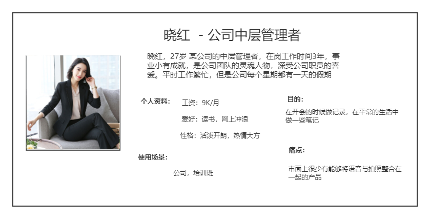
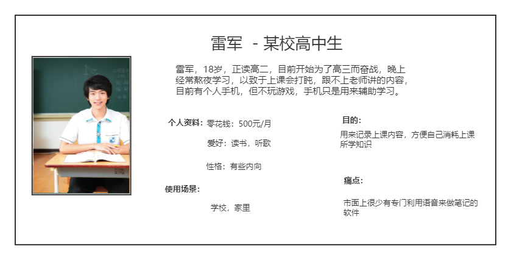
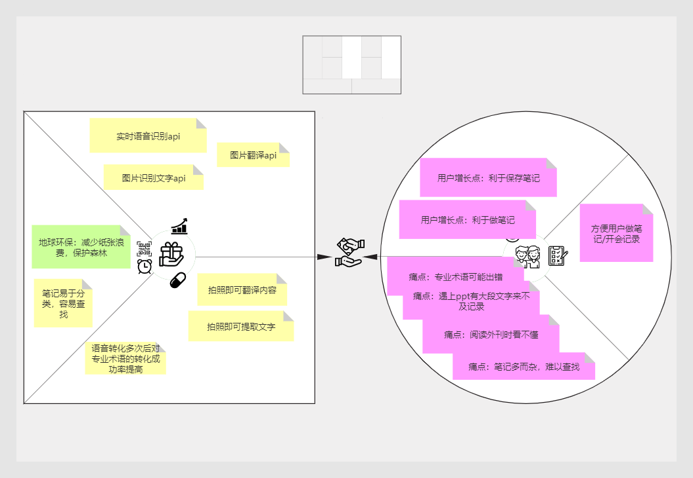
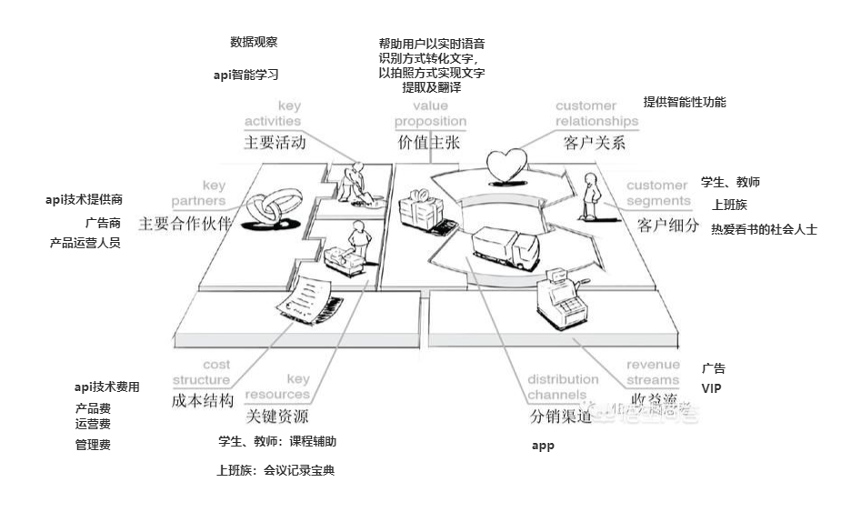
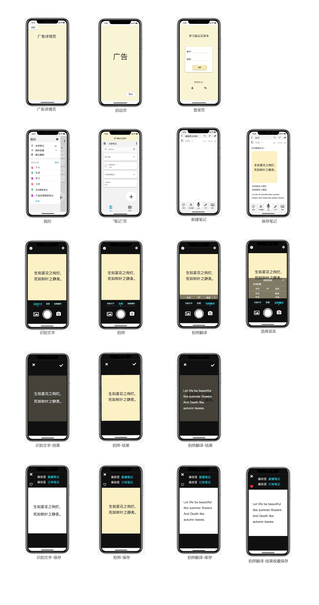

# 学习备忘记录本

## MVP加/价值主张宣言

我认为目前市场上对于能够实时语音识别与图片识别文字以及图片翻译进行有效以及高效整合的产品还没有出现，备忘学习记录本 App就是针对该漏洞对现在已有的拍照类App和翻译类App进行整合并加值和优化。其中，该App使用到的人工智能技术有实时语音识别api技术、图片识别文字api技术与图片翻译api技术，这些技术的综合运用能更好更有效的解决学生在开会或者学习做笔记时遇到的困难。

## 问题情境：

### 问题表述

在开会/上课时没精神记不住内容，或者来不及做笔记的时候，特别适合用此产品APP，因为本产品主打实时语音识别，能够快速识别出文字，帮助用户做笔记，除此之外，还提供了智能图片识别文字和翻译的功能，当你在做笔记时遇到有PPT展示内容时，你可以直接拍照得出上面的文字，不需要自己辛辛苦苦的写。

### 用户

#### 目标用户

学生、上班族、想学习的社会人士

#### 用户画像

* 若图片显示不出来，请点击[此处](https://gitee.com/crayon-heimi/API_Final/blob/master/images/yonghuhuaxiang.png)查看

* 若图片显示不出来，请点击[此处](https://gitee.com/crayon-heimi/API_Final/blob/master/images/yhhx.png)查看

### 使用情景

| 序号  | 使用情景  |
|---|---|
| 1 | 开会/上课时没精神记不住内容 |
| 2 | 老师/上司讲太快，来不及做笔记的时候  |
| 3 | 遇到ppt/书籍有大段文字需要记录  |
| 4 | 阅读外刊时不了解其主要意思  |

### 价值主张画布

* 图片模板由廖老师提供 

* 若图片显示不出来，请点击[此处](https://gitee.com/crayon-heimi/API_Final/blob/master/images/jiazhi.png)查看

### 商业画布

* 图片模板由廖老师提供

* 若图片显示不出来，请点击[此处](https://gitee.com/crayon-heimi/API_Final/blob/master/images/shangye.png)查看

### 需求列表及论证（利益相关者分析）

<table>
<thead>
<tr>
<th>优先级</th>
<th>需求</th>
<th>智能加值</th>
<th>API类型</th>
<th>需求论证</th>

</tr>
</thead>
<tbody>
<tr>
<td>1.A（重要）</td>
<td>快速记录会议/课堂内容</td>
<td> 是，利用实时语音识别api</td>
<td>讯飞实时语音识别</td>
<td> 系统性偏差：一开始使用时可能会对某些专业术语的转化有偏差，但是使用频率提高后准确率也会越来越高</td>

</tr>
<tr>
<td>2. A（重要）</td>
<td>快速提取文字</td>
<td> 是，利用图片识别文字api技术</td>
<td>百度智能云图片识别文字</td>
<td> 可持续：图片识别是未来发展的趋势，而文字只是其中最为简单的一种技术</td>

</tr>
<tr>
<td>3. B（次要）</td>
<td>帮助用户理解外文书籍</td>
<td> 是，利用图片翻译技术</td>
<td>有道智云图片翻译</td>
<td> ESG考量：可以减少翻译类书籍的发行，对于森林保护起着重要的作用</td>

</tr>
</tbody>
</table>

* 需求论证展示利害相关者分析:针对于环境这一问题，采用智能笔记本更有利于保护环境，对于森林保护起着重要的作用。对于可持续性而言，图片识别是未来发展的趋势，而文字只是其中最为简单的一种技术；系统性偏差方面，一开始使用时可能会对某些专业术语的转化有偏差

### 人工智能概率性

<table>
<thead>
<tr>
<th align="center">实时语音识别技术优势/用户痛点    </th>
<th align="center">自然语言翻译技术优势/用户痛点</th>
</tr>
</thead>
<tbody>
<tr>
<td align="center">1. 个性化输入：对于识别过的专业词汇引擎可将其识别出来，专业用语识别准确率高，方便用户提取准确信息 </td>
<td align="center">1. 语种丰富：提供27种语言高质量翻译服务，覆盖中、英、日、韩、俄、葡等热门语种,保证用户的学习能够正常进行</td>
</tr>
<tr>
<td align="center">2. 技术优：对于音频流能够实现毫秒级识别，快速将语音转化为文字，能够使用户实时得到内容      </td>
<td align="center">2. 技术优：支持神经网络翻译，根据用户翻译习惯不断优化翻译结果——提高翻译的准确性</td>
</tr>
<tr>
<td align="center">3. 智能预测：能够智能预测语境，提供智能断句和标点符号的预测，更加人性化地帮助用户做笔记     </td>
<td align="center">3. 功能丰富：可对图片进行翻译，支持多国语言——保证用户在拍照后能够进行内容翻译</td>
</tr>
</tbody>
</table>

## 解决方案

### 总述

1.采用讯飞实时语音识别技术，能够快速识别出文字，帮助用户做笔记；

2.采用百度智能云图片识别文字技术帮助用户提取所需图片的文字以及有道智云图片翻译技术，在阅读外刊时提供一定的帮助。

3.本产品对于上班族及在校学生都能使用，并且操作简单，没有技术难点。

4.对于商业方面，本APP启动页面可进行广告展示，吸引外商赞助，且后续还会增加VIP功能，为用户提供更多功能。

### IDEO三要素

| 三要素  | 总结  |
|---|---|
| Viability 商业可行性   | 由于现在人工智能技术的逐渐成熟，智能应用的正确率不断提高，造就了智能笔记本行业的远大前景。随着国家对教育政策的重视，我国的学生比例越来越多，毕业后成为上班族的人员居多，因此用于教育行业的产品越来越受欢迎。从本次疫情来看，线上办公类产品大受欢迎，这也是线上教育的一种机遇，因此，可用于学生及上班族进行线上记笔记的产品将有很好的发展趋势；再者，线上记笔记方式可以永久保存笔记，对于用户日后查找笔记有了更为简便的方式；最后，针对于环境这一问题，采用智能笔记本更有利于保护环境，对于森林保护起着重要的作用。|
| Feasibility 技术可行性   | 学习备忘记录本采用实时语音识别技术、图片识别文字和图片翻译技术，对于当下已有的拍照类App和翻译类App进行整合并加值和优化。三种技术可行性强，通过这三种技术便可以满足用户日常记录笔记需求。|
| Desirability 用户可欲性   | 随着科技的发展，对于各学科的学习也达到了一个鼎盛的时期，都说好记性不如烂笔头，学生在学习上常常需要记录大量的笔记，但往往这种方式是最耗时间且没有效率的，上课是如此，开会亦是如此，学生/上班族忙着记录笔记，都不能很好地消耗所听到的内容，一味地抄录却没能很好的理解其意思，最终也是很快便忘记了这个内容。但使用本APP，理解与记录两不误，何乐而不为|

#### 产品结构图

* 若图片显示不出来，请点击[此处](https://gitee.com/crayon-heimi/API_Final/blob/master/images/naotu.png)查看

#### 数据流程图DFD

* 若图片显示不出来，请点击[此处](https://gitee.com/crayon-heimi/API_Final/blob/master/images/dvd.png)查看

#### 用户旅程

* 若图片显示不出来，请点击[此处](https://gitee.com/crayon-heimi/API_Final/blob/master/images/yonghucz.png)查看

### 产品原型

#### [原型文档交互展示](https://modao.cc/app/659cfadccfd02aa1f0991a4db6df7ce986abdc9a?simulator_type=device&sticky#screen=skcq8b56l2r5tzw)

#### 界面详情

* 若图片显示不出来，请点击[此处](https://gitee.com/crayon-heimi/API_Final/blob/master/images/jm.png)查看

#### 界面流程图

* 若图片显示不出来，请点击[此处](https://gitee.com/crayon-heimi/API_Final/blob/master/images/jh.png)查看

#### 用户操作流程：

1.用户打开本APP，首先会看到赞助商的广告，这里可以选择“跳过”，登录成功后就可以进入本产品主页。

2.本产品主要有两个主页面，一个是“笔记”页（以下直接简称“主页”），一个是“相机”页，另外还有一个隐藏页面“我的”，点击“笔记”主页左上角即可查看。

3.用户记笔记的流程：可以直接点击“+”创建一个新的笔记。

4.按住底部中间“话筒”按钮，即可进行实时语音识别成文字。

5.如果需要上传照片，则可以点击“图片”按钮，可以选择图库上传，也可以现场拍照，这里以现场拍照为例，我们可以选择直接使用所拍照片，也可以切换成“识别文字”页面，在这里，你可以将所拍照片的文字提取出来，你可以选择将它保存在某个笔记里，也可以收藏。

6.除此之外，还可以切换成“拍照翻译”页面，这里你可以选择要翻译的语言，同样，翻译出来的文字也可以选择保存或者收藏。

7.如果你对以上所拍的内容不满意，还可以选择重拍。编辑好笔记内容，你可以点击笔记上方更改笔记名称以及笔记的分类，这样，就不用担心自己的笔记散乱无章啦！

8.退出笔记页面，你就可以在主页看到你刚才所编辑的笔记了，如果你不想保存这个笔记了，也可以点击主页右上角的按钮选择删除。

------

### Api技术文档

#### [科大讯飞](https://www.xfyun.cn/)

* [实时语音识别介绍](https://www.xfyun.cn/services/rtasr)

- [科大讯飞实时语音识别api官方技术文档]( https://www.xfyun.cn/doc/asr/rtasr/API.html)

* 接口说明：支持的音频格式： 采样率为16K，采样深度为16bits的pcm_s16le音频

- [输入](https://www.jianshu.com/p/2adec6027ea9)

- [输出](https://www.jianshu.com/p/2adec6027ea9)

* [实时语音识别定价](https://www.xfyun.cn/services/rtasr)

* 若图片显示不出来，请点击[此处](https://gitee.com/crayon-heimi/API_Final/blob/master/images/xfdj.png)查看

#### [百度智能云](https://cloud.baidu.com/)

* [图片识别文字介绍](https://cloud.baidu.com/product/ocr/general)

- [百度智能云图片识别文字api官方技术文档](https://cloud.baidu.com/doc/OCR/s/zk3h7xz52)

* 接口说明：，提供多场景、多语种、高精度的整图文字检测和识别服务

* [输入](https://www.jianshu.com/p/aecb8ad0904f)

* [输出](https://www.jianshu.com/p/aecb8ad0904f)

* [图片识别文字定价](https://cloud.baidu.com/doc/OCR/s/9k3h7xuv6)

* 若图片显示不出来，请点击[此处](https://gitee.com/crayon-heimi/API_Final/blob/master/images/badj.png)查看

#### [有道智云](http://ai.youdao.com/gw.s)

* [图片翻译介绍](http://ai.youdao.com/product-fanyi-picture.s)

- [有道智云图片翻译api官方技术文档](http://ai.youdao.com/DOCSIRMA/html/%E8%87%AA%E7%84%B6%E8%AF%AD%E8%A8%80%E7%BF%BB%E8%AF%91/API%E6%96%87%E6%A1%A3/%E5%9B%BE%E7%89%87%E7%BF%BB%E8%AF%91%E6%9C%8D%E5%8A%A1/%E5%9B%BE%E7%89%87%E7%BF%BB%E8%AF%91%E6%9C%8D%E5%8A%A1-API%E6%96%87%E6%A1%A3.html)

* 接口说明：通过调用图片翻译API，传入图片的Base64编码，指定源语言与目标语言，通过POST请求方式，就可以识别图片中的文字并进行翻译。

- [输入](https://www.jianshu.com/p/ea7dd9d0562e)

- [输出](https://www.jianshu.com/p/ea7dd9d0562e)

* [图片翻译定价](http://ai.youdao.com/product-fanyi-picture.s)

* 若图片显示不出来，请点击[此处](https://gitee.com/crayon-heimi/API_Final/blob/master/images/yddj.png)查看

### 竞品分析

<table>
<thead>
<tr>
<th>竞品</th>
<th>简介</th>
<th>定位</th>
<th>功能体验</th>
<th>与本产品所用api比较</th>
</tr>
</thead>
<tbody>
<tr>
<td> 百度实时语音识别 </td>
<td>一款基于Deep Peak2端到端建模，超过10万小时数据训练，多采样率多场景声学建模，近场中文普通话识别准确率达98%的产品</td>
<td>1. 多语种识别：支持普通话和略带口音的中文识别；2. 智能语言处理：对识别中间结果进行智能纠错，并根据语音的内容理解和停顿智能匹配合适的标点符号；3. 支持多设备终端，可以适用于多种操作系统、多设备终端均可使用</td>
<td>1. 能够音频流实时识别为文字，但是反应时间较长；2. 返回每句话的开始和结束时间，对于笔记而言过于繁杂；3. 适用于长句语音输入、音视频字幕、会议等场景，对于段语句可能识别性不强</td>
<td>1.本产品识别速度快，效果领先；2. 本产品支持自动文字训练，能够快速识别出现过的专业词汇；3. 本产品服务稳定高效；4.本产品综合语音能力强</td>
</tr>
<tr>
<td> 谷歌翻译 </td>
<td>一款功能强大的翻译软件，支持多国语言的相互翻译，以及多种输入模式</td>
<td>1. 全能型翻译软件。具有近百种语言，满足绝大多数需求；2. 提供更多种输入方式，适合于多种场景；3.  更加适合大篇幅文字的翻译</td>
<td>1. 安卓版具有“点击选择翻译区域”的功能，此功能比较适合于单行短小文字的翻译；2. 离线时只能支持实景翻译；3. 即时性并不强 </td>
<td>1.本产品支持多语种自动识别，适应不明确翻译语种等多复杂场景；2. 本产品翻译精准高效；3. 本产品提供更多元的输入方式，场景多元化</td>
</tr>
</tbody>
</table>

------

## 心得总结及感谢

通过本学期的学习，我觉得我更加了解了当今社会的发展趋势，从API到人工智能到未来可能盛行的类似于人类的智能机器人，一切都在从不可能到可能的过程发展，这一学期以来，我对API文档及PRD文档的撰写格式有了更为深入的了解。对一个产品从设想到呈现想法的过程更加的清晰。

感谢讯飞平台，百度智能云和有道智云提供技术文档供大家参考，感谢师姐[savor](https://github.com/NFUNM032/app-of-savor)作品对我PRD的书写起了一定的模板作用，感谢同学对于我PRD文档书写内容的建议。

点击[PPT](https://gitee.com/crayon-heimi/API_Final/blob/master/%E5%AD%A6%E4%B9%A0%E5%A4%87%E5%BF%98%E8%AE%B0%E5%BD%95%E6%9C%AC-%E8%BF%AD%E4%BB%A32.pptx)可跳转至下载页面

PPT可能会因为版本问题不能顺利播放语音。如果全部都不能播放，请联系我，我私发给你！感谢！

如果听到一半突然没声音，那就单独点击“小喇叭”，多试几遍就可以了，辛苦了！非常感谢！
