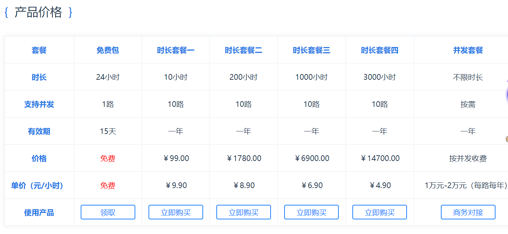

# 学习备忘记录本

## MVP加/价值主张宣言

我认为目前市场上对于能够实时语音识别与图片识别文字以及图片翻译进行有效以及高效整合的产品还没有出现，备忘学习记录本 App就是针对该漏洞对现在已有的拍照类App和翻译类App进行整合并加值和优化。其中，该App使用到的人工智能技术有实时语音识别api技术、图片识别文字api技术与图片翻译api技术，这些技术的综合运用能更好更有效的解决学生在开会或者学习做笔记时遇到的困难。

## 问题情境：

### 问题表述
问题表述 1：在开会/上课时没精神记不住内容，或者来不及做笔记的时候，特别适合用此产品APP，因为本产品主打实时语音识别，能够快速识别出文字，帮助用户做笔记，除此之外，还提供了智能图片识别文字和翻译的功能，当你在做笔记时遇到有PPT展示内容时，你可以直接拍照得出上面的文字，不需要自己辛辛苦苦的写。

问题表述 2：本产品适用于在校学生及上班族，在开会/上课时没精神记不住内容，或者来不及做笔记的时候，特别适合用此产品APP，因为本产品主打实时语音识别，能够快速识别出文字，帮助用户做笔记，除此之外，还提供了智能图片识别文字和翻译的功能，当你在做笔记时遇到有PPT展示内容时，你可以直接拍照得出上面的文字，不需要自己辛辛苦苦的写。

### 需求列表

<table>
<thead>
<tr>
<th>优先级</th>
<th>需求</th>
<th>智能加值</th>
<th>API类型</th>
<th>API类型-影响论证</th>

</tr>
</thead>
<tbody>
<tr>
<td>1.A（重要）</td>
<td>快速记录会议/课堂内容</td>
<td> 是</td>
<td>讯飞实时语音识别</td>
<td> 可持续</td>

</tr>
<tr>
<td>2. A（重要）</td>
<td>快速提取文字</td>
<td> 是</td>
<td>百度智能云图片识别文字</td>
<td> 可持续</td>

</tr>
<tr>
<td>3. B（次要）</td>
<td>帮助用户理解外文书籍</td>
<td>是 </td>
<td>有道智云图片翻译</td>
<td> 可持续</td>

</tr>
</tbody>
</table>

## 解决方案

### 总述

采用讯飞实时语音识别技术，能够快速识别出文字，帮助用户做笔记，再者，采用百度智能云图片识别文字技术帮助用户提取所需图片的文字以及有道智云图片翻译技术，在阅读外刊时提供一定的帮助。本产品对于上班族及在校学生都能使用，并且操作简单，没有技术难点。对于商业方面，本APP启动页面可进行广告展示，吸引外商赞助，且后续还会增加VIP功能，为用户提供更多功能。

#### 产品结构图

* 若图片因为没有翻墙而显示不出来，可点击[此处](https://gitee.com/crayon-heimi/API_Final/blob/master/images/naotu.png)查看

#### 交互界面流程图

* 若图片因为没有翻墙而显示不出来，可点击[此处](https://gitee.com/crayon-heimi/API_Final/blob/master/images/yonghucz.png)查看

#### 数据流程图DFD

* 若图片因为没有翻墙而显示不出来，可点击[此处](https://gitee.com/crayon-heimi/API_Final/blob/master/images/dvd.png)查看

#### 用户操作流程：

用户打开本APP，首先会看到赞助商的广告，这里可以选择“跳过”，登录成功后就可以进入本产品主页。本产品主要由两个主页面，一个是“笔记”页（以下直接简称“主页”），一个是“相机”页，另外还有一个隐藏页面“我的”，点击“笔记”主页左上角即可查看。用户记笔记的流程：可以直接点击“+”创建一个新的笔记，按住底部中间“话筒”按钮，即可进行实时语音识别成文字，如果需要上传照片，则可以点击“图片”按钮，可以选择图库上传，也可以现场拍照，这里以现场拍照为例，我们可以选择直接使用所拍照片，也可以切换成“识别文字”页面，在这里，你可以将所拍照片的文字提取出来，你可以选择将它保存在某个笔记里，也可以收藏。除此之外，还可以切换成“拍照翻译”页面，这里你可以选择要翻译的语言，同样，翻译出来的文字也可以选择保存或者收藏。如果你对以上所拍的内容不满意，还可以选择重拍。编辑好笔记内容，你可以点击笔记上方更改笔记名称以及笔记的分类，这样，就不用担心自己的笔记散乱无章啦！退出笔记页面，你就可以在主页看到你刚才所编辑的笔记了，如果你不想保存这个笔记了，也可以点击主页右上角的按钮选择删除。

#### 人工智能概率性

<table>
<thead>
<tr>
<th align="center">实时语音识别技术优势/用户痛点    </th>
<th align="center">自然语言翻译技术优势/用户痛点</th>
</tr>
</thead>
<tbody>
<tr>
<td align="center">1. 个性化输入：对于识别过的专业词汇引擎可将其识别出来，专业用语识别准确率高，方便用户提取准确信息 </td>
<td align="center">1. 语种丰富：提供27种语言高质量翻译服务，覆盖中、英、日、韩、俄、葡等热门语种,保证用户的学习能够正常进行</td>
</tr>
<tr>
<td align="center">2. 技术优：对于音频流能够实现毫秒级识别，快速将语音转化为文字，能够使用户实时得到内容      </td>
<td align="center">2. 技术优：支持神经网络翻译，根据用户翻译习惯不断优化翻译结果——提高翻译的准确性</td>
</tr>
<tr>
<td align="center">3. 智能预测：能够智能预测语境，提供智能断句和标点符号的预测，更加人性化地帮助用户做笔记     </td>
<td align="center">3. 功能丰富：可对图片进行翻译，支持多国语言——保证用户在拍照后能够进行内容翻译</td>
</tr>
</tbody>
</table>

#### [原型文档交互展示](https://modao.cc/app/659cfadccfd02aa1f0991a4db6df7ce986abdc9a?simulator_type=device&sticky)

------

### 本产品Api技术文档

- [科大讯飞实时语音识别api输入及输出](https://www.jianshu.com/p/2adec6027ea9)  **操作步骤**都在文档里，点击可查看详情

- [百度智能云图片识别文字api技术文档](https://www.jianshu.com/p/aecb8ad0904f)  **操作步骤**都在文档里，点击可查看详情

- [有道智云图片翻译api技术文档](https://www.jianshu.com/p/ea7dd9d0562e)  **操作步骤**都在文档里，点击可查看详情

------

###  各Api技术文档

#### [科大讯飞](https://www.xfyun.cn/)

* [实时语音识别介绍](https://www.xfyun.cn/services/rtasr)

- [科大讯飞实时语音识别api]( https://www.xfyun.cn/doc/asr/rtasr/API.html)

* [实时语音识别定价](https://www.xfyun.cn/services/rtasr)

* 若图片因为没有翻墙而显示不出来，可点击[此处](https://gitee.com/crayon-heimi/API_Final/blob/master/images/xfdj.png)查看

#### [百度智能云](https://cloud.baidu.com/)

* [图片识别文字介绍](https://cloud.baidu.com/product/ocr/general)

- [百度智能云图片识别文字api]( https://cloud.baidu.com/doc/OCR/s/zk3h7xz52)

* [图片识别文字定价](https://cloud.baidu.com/doc/OCR/s/9k3h7xuv6)

* 若图片因为没有翻墙而显示不出来，可点击[此处](https://gitee.com/crayon-heimi/API_Final/blob/master/images/badj.png)查看

#### [有道智云](http://ai.youdao.com/gw.s)

* [图片翻译介绍](http://ai.youdao.com/product-fanyi-picture.s)

- [有道智云图片翻译api](http://ai.youdao.com/DOCSIRMA/html/%E8%87%AA%E7%84%B6%E8%AF%AD%E8%A8%80%E7%BF%BB%E8%AF%91/API%E6%96%87%E6%A1%A3/%E5%9B%BE%E7%89%87%E7%BF%BB%E8%AF%91%E6%9C%8D%E5%8A%A1/%E5%9B%BE%E7%89%87%E7%BF%BB%E8%AF%91%E6%9C%8D%E5%8A%A1-API%E6%96%87%E6%A1%A3.html)

* [图片翻译定价](http://ai.youdao.com/product-fanyi-picture.s)

* 若图片因为没有翻墙而显示不出来，可点击[此处](https://gitee.com/crayon-heimi/API_Final/blob/master/images/yddj.png)查看

------

## 心得总结及感谢

api说难不难，说简单也不简单，把握好技术文档的书写，其实你已经成功了一半。

感谢讯飞平台，百度智能云和有道智云提供技术文档供大家参考，本次api技术文档的书写就是参考其技术文档而来。

* [PPT链接](https://aippt.wps.cn/view/210758[WPS智能PPT]产品市场工作周报.pptx)

